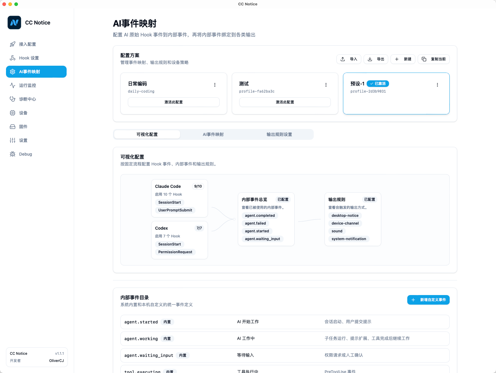
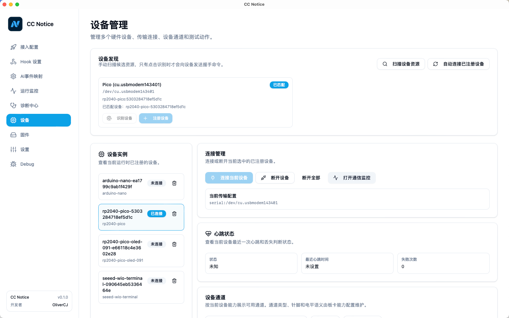
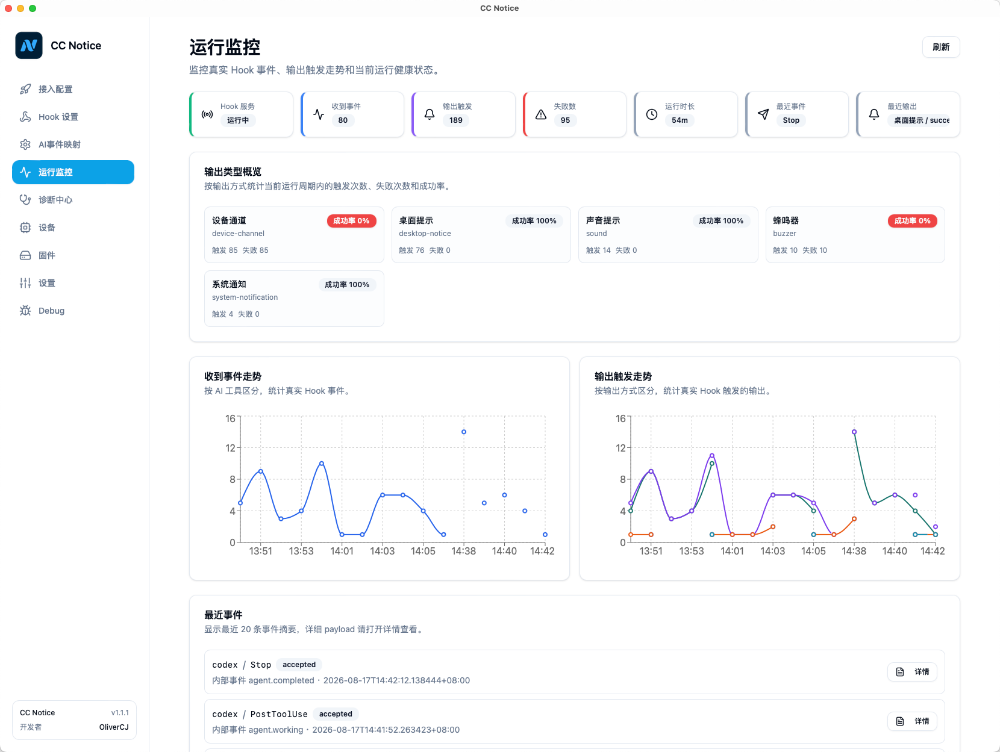
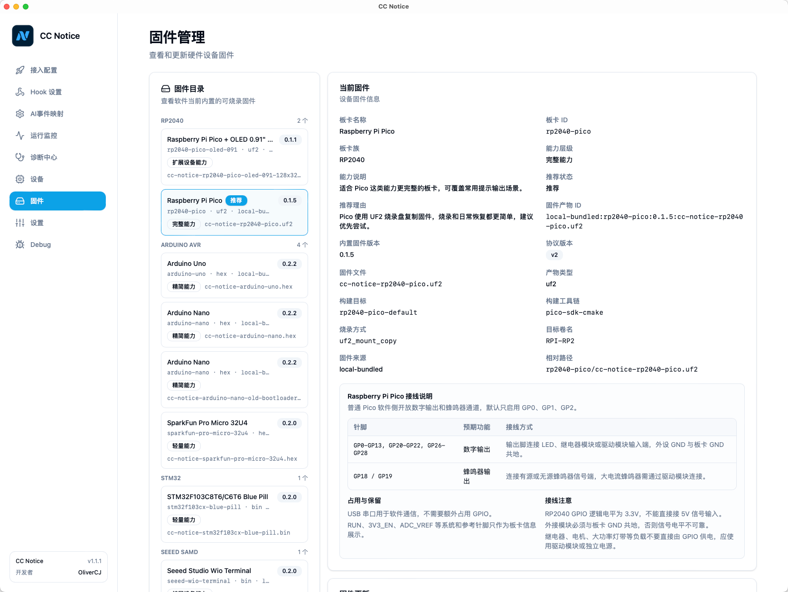
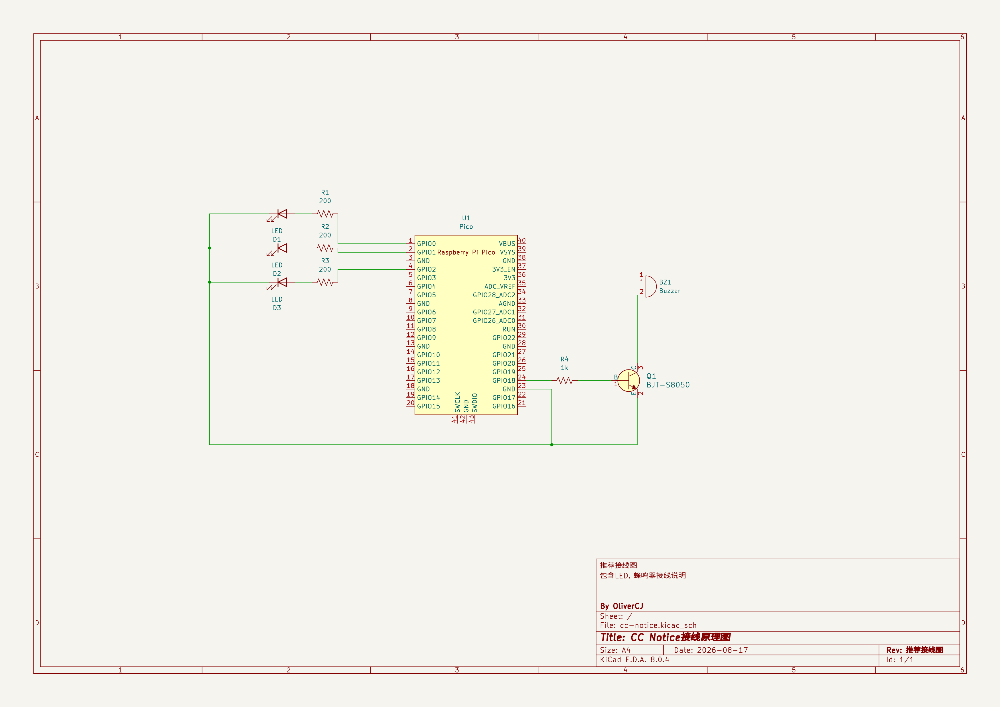
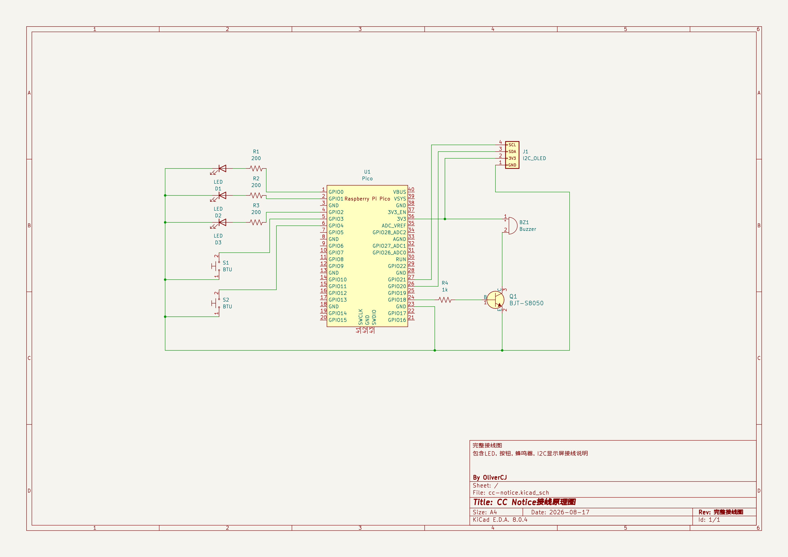

# CC Notice

<p align="center">
  
</p>

<p align="center">
  AI Coding Notice Center for Desktop and Hardware
</p>

<p align="center">
  <a href="LICENSE"></a>
  
  
</p>

CC Notice 是一个面向 AI 编程工作流的桌面提示工具。它接收 Claude Code、Codex 等工具的 Hook 事件，并把任务状态通过系统通知、声音、Webhook 或外接硬件设备反馈出来。

适合这些场景：

- AI 任务开始、完成、失败或等待确认时，及时获得桌面提示。
- 长时间运行 Codex / Claude Code 时，不必一直盯着终端。
- 使用灯、蜂鸣器、OLED 屏幕等硬件显示 AI 工作状态。
- 在不同 AI 工具之间统一 Hook 配置、事件映射和输出规则。

## 功能

- **Hook 接入**：支持 Claude Code、Codex 等 AI 工具的 Hook 事件接收。
- **规则配置**：把 AI 事件映射到系统通知、声音、Webhook 和设备输出。
- **设备管理**：支持串口设备扫描、识别、注册、连接和运行状态监控。
- **内置固件**：随软件内置已验证固件，用户可在固件页面直接烧录。
- **硬件输出**：支持数字输出、蜂鸣器、屏幕显示等设备能力。
- **诊断工具**：提供运行监控、链路日志、设备健康和配置诊断。
- **多语言界面**：支持中文和英文界面。

## 软件截图

以下截图来自 `v1.1.1` 版本界面。

### AI 事件映射

集中管理 Claude Code、Codex 等工具的 Hook 事件，把 AI 原始事件映射到应用内部事件，再按规则触发桌面提示、声音、Webhook 或硬件输出。



### 设备管理

扫描串口设备后可识别、注册和连接硬件，查看设备实例、连接状态、心跳状态和通道能力。



### 运行监控

查看 Hook 服务状态、事件接收数量、输出触发情况、失败次数和最近事件，便于排查规则和输出链路。



### 固件管理

内置已验证固件，按板卡查看固件信息、能力说明、接线提示和烧录入口。



## 支持平台

| 平台 | 状态 | 说明 |
| --- | --- | --- |
| macOS | 可用 | 当前免费包未签名、未公证，首次打开可能需要手动允许运行。 |
| Windows | 构建支持 | 需要在目标系统上验证串口、通知和声音输出。 |

macOS 如果提示应用无法打开，可以执行：

```bash
sudo xattr -r -d com.apple.quarantine /Applications/CC\ Notice.app
```

## 支持硬件

推荐优先使用 **Raspberry Pi Pico**。它基于 RP2040，资源充足、价格低、I/O 丰富，UF2 拖拽烧录简单，不依赖额外上传工具。

### 推荐硬件方案：Raspberry Pi Pico

Pico 是当前最推荐的入门板卡。普通 Pico 固件默认适合做状态灯、蜂鸣器和简单外设输出；OLED 版本则适合需要屏幕显示任务状态的场景。首次搭建建议先按推荐接线完成 LED 和蜂鸣器测试，确认设备识别、注册和功能下发都正常后，再增加按钮和 OLED。

推荐接线参考：

- **状态灯**：可使用 GP0、GP1、GP2 等 GPIO 连接 LED。每路 LED 建议串联 200-470Ω 限流电阻后接到 GND。
- **蜂鸣器**：推荐使用无源蜂鸣器。建议使用 GP18 作为控制脚，通过 1kΩ 左右电阻接三极管基极，由三极管驱动蜂鸣器；蜂鸣器供电可接 Pico 的 `3V3_OUT`，另一端接三极管集电极，发射极接 GND。固件会根据软件下发的不同声音类型输出不同频率的方波。
- **共地**：LED、蜂鸣器驱动电路和 Pico 必须共地。
- **电平限制**：Pico GPIO 是 3.3V 逻辑，不要把 5V 信号直接接入 GPIO。
- **电流限制**：GPIO 只适合输出控制信号，不建议直接驱动大电流蜂鸣器、灯带、继电器等负载；这类负载应使用三极管、MOSFET 或驱动模块。



如果需要完整功能，可以参考下图接入 LED、按钮、蜂鸣器和 I2C OLED：

- **按钮输入**：按钮一端接 GPIO，另一端接 GND。连接设备后，在软件的设备通道里添加功能引脚，把对应 GPIO 设置为输入，并映射到具体按键。
- **OLED 显示屏**：目前内置 Pico OLED 固件只支持 0.91 寸 I2C OLED，分辨率为 128x32。推荐按图使用 I2C 接线，SCL 接 GP21，SDA 接 GP20，VCC 接 `3V3_OUT`，GND 接 GND。
- **显示屏扩展**：后续会开放更多分辨率和类型的显示屏支持；当前请优先使用 0.91 寸 128x32 I2C OLED 测试。



软件内置的 Pico 通道能力会按固件和板型展示。烧录完成后，在设备页面扫描、识别并注册设备，再按实际接线选择对应通道进行测试。

当前内置固件覆盖：

- Raspberry Pi Pico
- Raspberry Pi Pico + OLED 0.91
- Arduino Uno
- Arduino Nano
- SparkFun Pro Micro 32U4
- Seeed Studio Wio Terminal
- STM32F103Cx Blue Pill

Arduino Uno / Nano、Pro Micro 和 STM32 受限于 Flash / SRAM 或烧录方式，支持能力会少于 RP2040 和 Wio Terminal。烧录 Arduino / STM32 目标时，仍需要按页面提示安装 Arduino CLI、STM32CubeProgrammer 等上传工具。

## 快速开始

1. 下载或构建 CC Notice。
2. 打开应用，完成初始化向导。
3. 在 Hook 设置中选择 AI 工具并写入 Hook 配置。
4. 在规则页面配置事件映射和输出方式。
5. 如果使用硬件设备，在固件页面烧录固件，再到设备页面识别和注册设备。

## 开发构建

依赖：

- Node.js
- npm
- Rust / Cargo
- 平台对应的 Tauri 系统依赖

安装rust依赖

- 打开官方安装页：https://www.rust-lang.org/zh-CN/tools/install
- 根据自己的系统下载安装对应依赖工具
- 安装后检查依赖
```bash
cargo --version
```

安装开发依赖：

```bash
npm ci
```

relay上报工具构建
```bash
npm run build:relay
```

前端构建：

```bash
npm run build
```

开发运行：

```bash
npm run tauri -- dev
```

Windows PowerShell 或 cmd 下也使用同一条命令；项目的 Tauri npm 脚本会通过跨平台 Node 启动器调用本地 Tauri CLI，不需要额外安装 `sh`。

生产打包：

```bash
npm run tauri -- build
```

Windows PowerShell 下也可直接使用：

```powershell
npx tauri build
```


软件构建不会编译固件。固件产物已经随 `src-tauri/assets/firmware` 提交，Tauri 打包时会作为应用资源内置。

## Codex Skills

仓库内置两个维护用 Codex skill：

- `skills/cc-notice-ai-tool-onboarding`：新增或更新 AI 工具 Hook 接入时使用。
- `skills/cc-notice-board-onboarding`：新增或更新内置板卡、固件、针脚和设备通道时使用。

使用 Codex 参与维护前，建议安装这两个 skill：

```bash
mkdir -p ~/.codex/skills
cp -R skills/cc-notice-ai-tool-onboarding ~/.codex/skills/
cp -R skills/cc-notice-board-onboarding ~/.codex/skills/
```

如果已有同名 skill，先删除旧目录或确认内容后再覆盖，避免 Codex 读取到过期流程。

## 发布构建

macOS 多架构发布包：

```bash
npm run package:mac:x64
npm run package:mac:arm64
npm run package:mac:universal
```

Windows NSIS 安装包：

```bash
npm run package:win
```

GitHub Actions 提供 app 级 CI 和 Release workflow，只构建软件本体，不运行固件构建脚本。

更多说明见 [docs/build-and-release.md](docs/build-and-release.md)。

## 反馈

欢迎通过 Issue 反馈问题、建议和硬件测试结果。

## 许可证

本项目使用 MIT License，详见 [LICENSE](LICENSE)。
